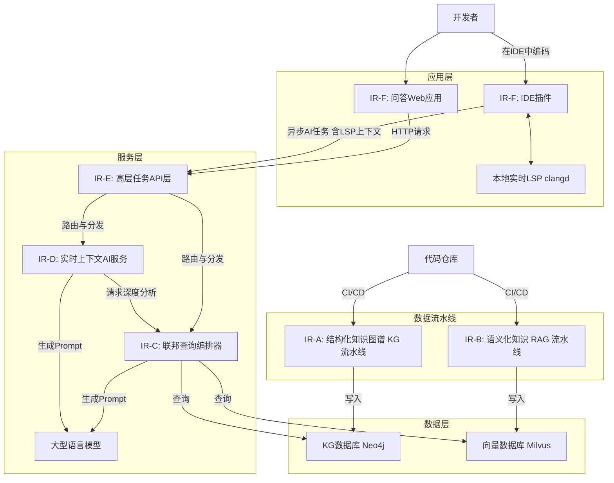

```mermaid
graph TD
    subgraph 应用层
        direction LR
        F2[IR-F: IDE插件]
        LocalLSP[本地实时LSP clangd]
        F1[IR-F: 问答Web应用]
        F2 <--> LocalLSP
    end

    subgraph 服务层
        E[IR-E: 高层任务API层]
        C[IR-C: 联邦查询编排器]
        D[IR-D: 实时上下文AI服务]
        LLM[大型语言模型]
    end

    subgraph 数据层
        DB_A[KG数据库 Neo4j]
        DB_B[向量数据库 Milvus]
    end

    subgraph 数据流水线
        IR_A[IR-A: 结构化知识图谱 KG 流水线]
        IR_B[IR-B: 语义化知识 RAG 流水线]
    end

    User[开发者] --> F1
    User -- 在IDE中编码 --> F2

    F1 -- HTTP请求 --> E
    F2 -- 异步AI任务 含LSP上下文 --> E

    E -- 路由与分发 --> C
    E -- 路由与分发 --> D

    D -- 请求深度分析 --> C
    C -- 查询 --> DB_A
    C -- 查询 --> DB_B
    C -- 生成Prompt --> LLM
    D -- 生成Prompt --> LLM

    Repo[代码仓库] -- CI/CD --> IR_A
    Repo -- CI/CD --> IR_B

    IR_A -- 写入 --> DB_A
    IR_B -- 写入 --> DB_B
```
